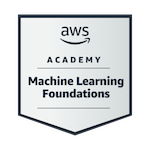

  

<h1 align="center" style="font-size: 52px;">👋 Hi, I'm <strong>Karan Patel</strong></h1>

  

 

  

---

<h2 align="center">🚀 About Me</h2>

📠Final-year B.Tech (AI & ML) student at <strong>Adani University</strong> 
🚗 <strong>Car Enthusiast</strong> with a vision for automotive intelligence 
🤖 Building powerful <strong>AI Automation Agents & Workflows (n8n)</strong> 
☁️ Certified in <strong>AWS & Jira</strong> | Explorer of <strong>Cloud & Data Viz</strong> 
📍 Based in <strong>Ahmedabad, India</strong> — open for <strong>internships & collabs</strong>

---

<h2 align="center">🛠️ Skills & Tools</h2>

### 🖥️ Programming Languages

  
  
  
  
  
  

### 🧠 AI / ML / Deep Learning

  
  
  
  
  
  
  
  
  
  

### 📊 Data Visualization

  
  
  
  

### ☁️ Cloud, Automation & Dev Tools

  
  
  
  
  
  
  

### ⚒️ Frameworks & Tools

  
  

---

<h2 align="center">📜 Certifications</h2>

🟡 <strong>AWS Machine Learning Foundations</strong>  
🟡 <strong>AWS Cloud Architecting</strong>  
🔵 <strong>Jira Fundamentals – Coursera</strong>  
🟢 <strong>Python for Data Science – CognitiveClasses.ai</strong>  
🟢 <strong>Data Science 101 – CognitiveClasses.ai</strong>  
🟢 <strong>Build Your Own Chatbot - CognitiveClasses.ai</strong>  
🟢 <strong>Deep Learning Using TensorFlow – CognitiveClasses.ai</strong>  
🟢 <strong>Big Data 101 – CognitiveClasses.ai</strong>  
🟢 <strong>SQL And Relational Database - CognitiveClasses.ai</strong>   

📂 <a href="https://github.com/Karanpatel3114/CERTIFICATES"><strong>Certificate Repository</strong></a>  
🎖️ <a href="https://www.credly.com/users/karan-patel.15e49af4"><strong>Verified Credly Badges</strong></a>

<table align="center">
  <tr>
    <td align="center">
       
      <b>AWS Cloud Architecting</b>
    </td>
    <td align="center">
       
      <b>AWS ML Foundations</b>
    </td>
    <td align="center">
       
      <b>Python for Data Science</b>
    </td>
  </tr>
  <tr>
    <td align="center">
       
      <b>Data Science 101</b>
    </td>
    <td align="center">
       
      <b>Chatbot without Coding</b>
    </td>
    <td align="center">
       
      <b>Deep Learning w/ TensorFlow</b>
    </td>
  </tr>
  <tr>
    <td align="center">
       
      <b>Big Data Foundations</b>
    </td>
    <td></td>
    <td></td>
  </tr>
</table>

---

<h2 align="center">🎯 Current Focus</h2>

🔠Building <strong>AI Agents with n8n & LLMs</strong> 
🧠 Mastering <strong>CNN, LSTM, RNN Architectures</strong> 
☁️ Learning <strong>Cloud + Cybersecurity</strong> 
🚘 Passion Project: <strong>AI for Automotive Systems</strong>

---

## 📈 GitHub Stats

---

<h2 align="center">💡 Dev Quote</h2>

  

---

<h2 align="center">🐍 GitHub Activity Snake</h2>

  

---

<h2 align="center">📫 Let's Connect</h2>

  📧 <strong>Email:</strong> karan11005566@gmail.com  
  🔗 <strong>LinkedIn:</strong> <a href="https://www.linkedin.com/in/karan-patel-727769217">karan-patel-727769217</a>

---

<i>🠓Driven by code, powered by passion — let's build the future!â€</i>

