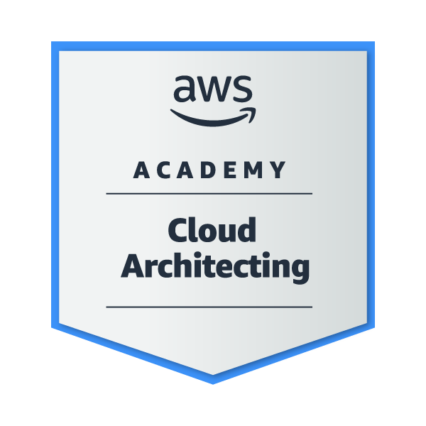

# 👋 Hi, I'm Karan Patel

🎓 Final-year B.Tech (AI & ML) student at Adani University  
🚗 Car Enthusiast | 🤖 Exploring AI Automation & AI Agents  
☁️ AWS & Jira Certified | 📊 Data Visualization Practitioner  
🌱 Always learning — LSTM, CNN, n8n, and more  
📍 Ahmedabad, India | Open to internships & collaborations

---

## 🧠 Skills & Tools

### 💻 Programming
`Python` `HTML` `PHP` `JavaScript`

### 🧠 AI/ML
`TensorFlow` `CNN` `RNN` `LSTM` `AI Agents` `Deep Learning`

### 📊 Data Visualization
`Matplotlib` `Seaborn` `Plotly` `Power BI`

### ☁️ Cloud & Automation
`AWS` `GitHub` `Jira` `Jenkins` `n8n` `Git`

---

## 📜 Certifications

- 🟡 **AWS Machine Learning Foundations**
- 🟡 **AWS Cloud Architecting**
- 🔵 **Jira Fundamentals – Coursera**

📂 See my certificates [here](https://github.com/Karanpatel3114/CERTIFICATES)

---

## 🚀 Interests

- AI Automation 🤖
- Building AI Agents using n8n & LLMs  
- Cloud + Cybersecurity ☁️🛡  
- Automotive Tech & Vehicle Intelligence 🚘  

---

## 📈 GitHub Stats

---

## 📫 Contact Me

- 📧 Email: karan11005566@gmail.com  
- 🔗 LinkedIn: [karan-patel-727769217](https://www.linkedin.com/in/karan-patel-727769217/)

---

> “Driven by code, powered by passion — let's build the future!” 🚀
